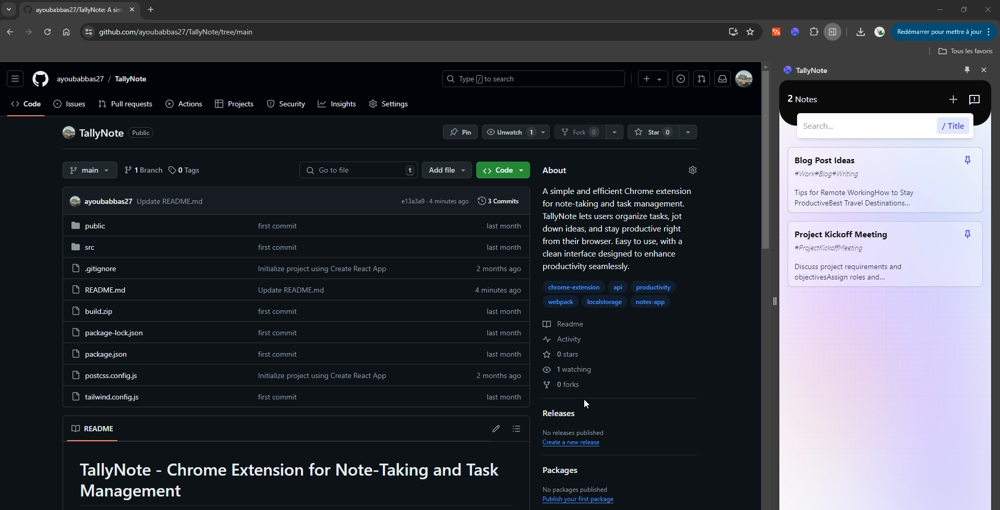
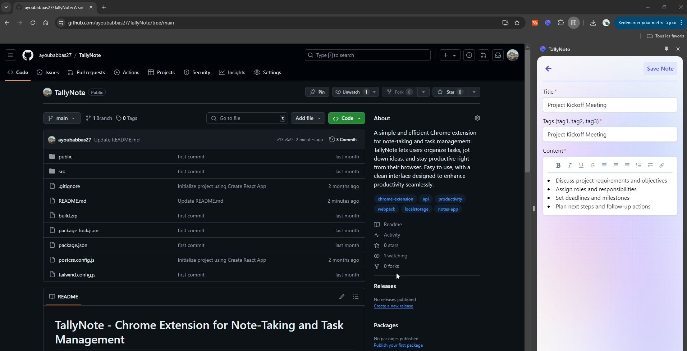

# TallyNote - Chrome Extension for Note-Taking and Task Management

## Overview
TallyNote is a simple and efficient Chrome extension designed for note-taking and task management. It enables users to organize tasks, jot down ideas, and stay productive directly from their browser. With its clean interface and ease of use, TallyNote enhances productivity seamlessly.

## Features
- **Note-Taking**: Quickly jot down ideas and notes.
- **Task Management**: Create, organize, and manage tasks efficiently.
- **Browser Integration**: Seamless integration with the Chrome browser for quick access.
- **Clean Interface**: User-friendly design focused on enhancing productivity.
- **Persistent Storage**: Notes and tasks are saved and synced across sessions.

## Technical Stack
- **Frontend**: 
  - **HTML5**: For structuring the extension interface.
  - **CSS3**: For styling the extension.
  - **JavaScript**: For handling the extension logic.
  - **Chrome Extension API**: For integrating with the browser and managing extension functionality.

## Screenshots
### Main Interface

### Task Management

## Challenges and Solutions
### Browser Integration:
- **Challenge**: Ensuring seamless integration with the Chrome browser for a smooth user experience.
- **Solution**: Leveraged the Chrome Extension API to create a user-friendly and responsive extension.

### Data Persistence:
- **Challenge**: Ensuring notes and tasks are saved and remain accessible across browser sessions.
- **Solution**: Implemented local storage to persist data and sync across sessions.

### User Interface Design:
- **Challenge**: Creating an intuitive and clean interface to enhance productivity.
- **Solution**: Used modern web design principles and CSS for a clean and user-friendly interface.

## Contributing
Contributions are welcome! If you have any suggestions, improvements, or bug fixes, please fork the repository and submit a pull request.
